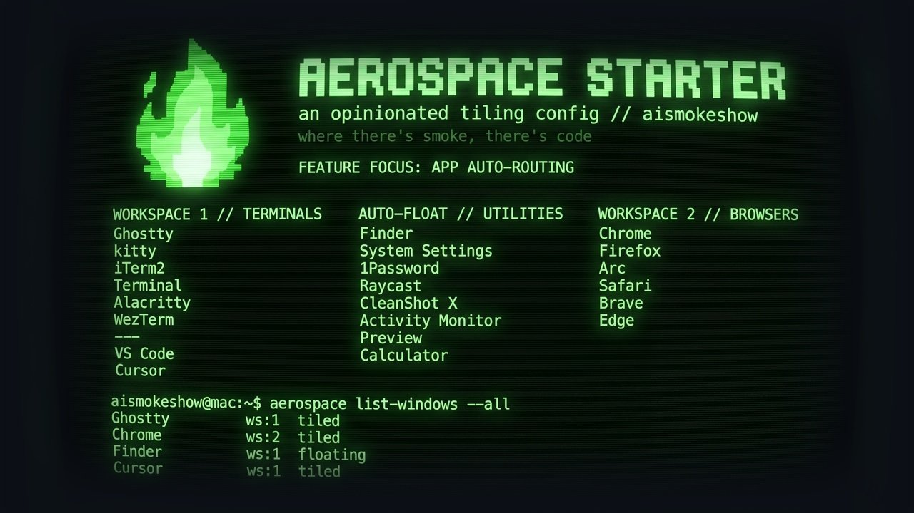
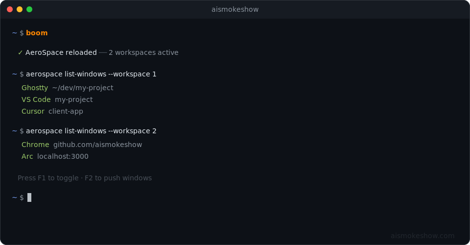

<div align="center">

# AISMOKESHOW AeroSpace Tiling Starter

**One monitor. Two workspaces. One key.**

An opinionated AeroSpace tiling config for macOS. Terminals on workspace 1, browsers on workspace 2, F1 to toggle *instantly* between the two.

<p>
  
  &nbsp;
  
  &nbsp;
  
</p>

<p>
  <picture>
    <source media="(prefers-color-scheme: dark)" srcset="images/aerospace-ais-hero-dark.jpg">
    <source media="(prefers-color-scheme: light)" srcset="images/aerospace-ais-hero-light.jpg">
    
  </picture>
</p>

<em>"Tried yabai, Amethyst, and Rectangle. This is the one I kept."</em>

</div>

---

<p align="center">
  <a href="#install">Install</a> ·
  <a href="#how-it-works">How It Works</a> ·
  <a href="#keybindings">Keybindings</a> ·
  <a href="#keep-going">Keep Going</a>
</p>

## Install

Paste this in your terminal:

```bash
claude --dangerously-skip-permissions "clone https://github.com/aismokeshow/aerospace-starter to ~/.aismokeshow/aerospace-starter then cd in and follow the CLAUDE.md"
```

That's it. Claude clones the repo, reads the install instructions, and handles everything — Homebrew, AeroSpace, config linking, macOS settings, and scans your apps to build a custom tiling layout. The only manual step is granting Accessibility permissions when macOS asks.

> [!TIP]
> **Re-installing or already have the folder?** Open Claude Code in `~/.aismokeshow/aerospace-starter` and type `/install`.

## Why This Exists

I built this for people like me who are finally done going down tiling manager rabbit hole after rabbit hole. [Yabai](https://github.com/koekeishiya/yabai), [Amethyst](https://github.com/ianyh/Amethyst), [FlashSpace](https://github.com/wojciech-kulik/FlashSpace), [skhd](https://github.com/koekeishiya/skhd). They're all great projects, and they all have their place — but sometimes you get to a point where you're done tinkering with configs and you just want something that *works*.

This is for you. Unplug your other three monitors, focus on one, and install this. The mental model is dead simple — one monitor, two workspaces, one key to toggle. The config file is ~80 lines of actual settings plus ~200 lines of app routing rules (which apps go where). Those routing rules are just a lookup table — `/scan-apps` writes them for you.

<p align="center">
  
</p>

---

## How It Works

<p align="center">
  
</p>

- **Workspace 1** is for terminals and editors — [Ghostty](https://ghostty.org), [Kitty](https://github.com/kovidgoyal/kitty), [VS Code](https://code.visualstudio.com), [Cursor](https://cursor.com), and more
- **Workspace 2** is for browsers — [Chrome](https://www.google.com/chrome/), [Firefox](https://www.mozilla.org/firefox/), [Arc](https://arc.net), [Safari](https://www.apple.com/safari/), [Brave](https://brave.com), [Edge](https://www.microsoft.com/edge)
- **F1** toggles between them. **F2** pushes a window across.
- Windows tile themselves — no manual dragging or resizing needed
- Change the config with `/customize`, or type `boom` to reload manually

See the full [routing rules in aerospace.toml](aerospace.toml#L79-L141) for the complete list of auto-routed apps.

<p align="center">
  
</p>

## Keybindings

| Key | Action |
|---|---|
| **F1** | Toggle workspace 1 ↔ 2 |
| **F2** | Push window to other workspace |
| **Opt+H/J/K/L** | Focus left/down/up/right |
| **Opt+Shift+H/J/K/L** | Move window left/down/up/right |
| **Opt+Shift+R** | Rescue lost windows |

**Opt is the Option (⌥) key.** That's just day one — there's more in the [full keybindings](docs/KEYBINDINGS.md). All bindings are defined in [`aerospace.toml`](aerospace.toml#L32-L69).

<details>
<summary><strong>Where do my apps go?</strong></summary>

**Workspace 1** — terminals & editors
[Ghostty](https://ghostty.org), Terminal, [iTerm2](https://iterm2.com), [Kitty](https://github.com/kovidgoyal/kitty), [Alacritty](https://github.com/alacritty/alacritty), [WezTerm](https://wezfurlong.org/wezterm/), [VS Code](https://code.visualstudio.com), [Cursor](https://cursor.com)

**Workspace 2** — browsers
[Chrome](https://www.google.com/chrome/), [Firefox](https://www.mozilla.org/firefox/), [Arc](https://arc.net), [Safari](https://www.apple.com/safari/), [Brave](https://brave.com), [Edge](https://www.microsoft.com/edge)

**Auto-float** — apps that don't tile well
Finder, System Settings, Calculator, Preview, Activity Monitor,
[1Password](https://1password.com), [Raycast](https://www.raycast.com), [CleanShot X](https://cleanshot.com), Adobe apps, and more

Everything else tiles by default. These rules make up most of the config file (~200 of ~300 lines) — they're a lookup table, not complexity. Type `/scan-apps` to detect your installed apps and configure them automatically, or `/customize` for one-offs. See [Customization](docs/CUSTOMIZATION.md) for the full manual approach.

</details>

<a id="what-does-install-change-on-my-mac"></a>
<details>
<summary><strong>What does /install change on my Mac?</strong></summary>

The install process makes these changes (Claude asks before each one):

- **Installs [Homebrew](https://brew.sh)** (if not present) — the macOS package manager
- **Installs AeroSpace** via Homebrew — the tiling window manager
- **Changes 4 macOS settings** — disables Apple's built-in tiling (conflicts with AeroSpace) and remaps F1 from brightness to a regular function key
- **Creates a symlink** — `~/.config/aerospace` points to this repo folder so AeroSpace reads the config from here
- **Adds one alias** to `~/.zshrc` — the `boom` reload command (zsh is the macOS default; Claude auto-detects bash/fish and adjusts)
- **Scans your /Applications** to auto-configure app routing rules

The only step that can't be automated is granting Accessibility permissions (macOS security requirement).

`/uninstall` reverses all of this.

</details>

### Slash Commands

**Five slash commands** — everything you need after install:

| Command | What it does |
|---|---|
| `/install` | Full setup — Homebrew, AeroSpace, config, macOS settings, app scan |
| `/scan-apps` | Detect installed apps and configure them in your tiling layout |
| `/customize` | Change keybindings, app routing, gaps, workspaces, layouts |
| `/troubleshoot` | Diagnose and fix problems — runs a full checklist automatically |
| `/uninstall` | Clean removal — reverses all install changes |

<details>
<summary><strong>Manual setup (without Claude Code)</strong></summary>

```bash
# 1. Install AeroSpace (requires Homebrew — https://brew.sh)
brew install --cask nikitabobko/tap/aerospace

# 2. Clone this repo
mkdir -p ~/.aismokeshow
git clone https://github.com/aismokeshow/aerospace-starter.git ~/.aismokeshow/aerospace-starter
cd ~/.aismokeshow/aerospace-starter

# 3. Link as your AeroSpace config
mkdir -p ~/.config
ln -sfn "$PWD" ~/.config/aerospace
chmod +x *.sh

# 4. Add the reload command to your shell
# zsh (default): ~/.zshrc | bash: ~/.bashrc | fish: ~/.config/fish/config.fish
echo "alias boom='~/.config/aerospace/boom.sh'" >> ~/.zshrc
source ~/.zshrc
```

Then follow the [Setup Guide](docs/SETUP.md) to flip four macOS settings.

</details>

## Works With Other Starters

| Starter | What it adds | Interaction |
|---|---|---|
| [dotfiles-starter](https://github.com/aismokeshow/dotfiles-starter) | Modern shell config — [Zerobrew](https://github.com/lucasgelfond/zerobrew), [Starship](https://starship.rs), [Sheldon](https://sheldon.cli.rs), 12 CLI tools | `boom` alias added to your shell config |
| [statusline-starter](https://github.com/aismokeshow/statusline-starter) | [Claude Code](https://github.com/anthropics/claude-code) statusline with context tracking | Zero interaction — runs via `settings.json` |

Install order doesn't matter. Each project detects the others and adapts.

## Keep Going

- **[Setup Guide](docs/SETUP.md)** — two minutes of macOS settings, then you're done forever
- **[Keybindings](docs/KEYBINDINGS.md)** — day-one keys, power-user keys, and where your apps land
- **[Customization](docs/CUSTOMIZATION.md)** — `/customize` for quick changes, or manual if you prefer
- **[Troubleshooting](docs/TROUBLESHOOTING.md)** — `/troubleshoot` runs a full diagnostic, or check the manual fixes

> [!WARNING]
> This project tells Claude Code to run shell commands on your Mac. Only clone from the [official repo](https://github.com/aismokeshow/aerospace-starter) — forks can modify the instructions Claude follows. If you're using a fork, review the `CLAUDE.md` and `.claude/` directory before running `/install`. (The install procedure scans the repo for suspicious content before making any system changes.)

## License

AeroSpace Starter is released under the [MIT License](LICENSE).

---

<p align="center"><sub>built by <a href="https://www.aismokeshow.com/">aismokeshow</a> · where there's boom, there's smoke</sub></p>
